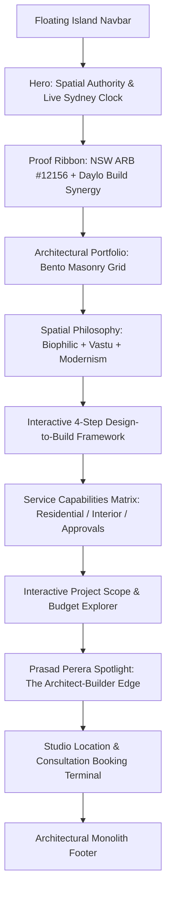

# DP Design Studio — Complete Brand, Architectural & Redesign Context

> **Project:** Complete Website Redesign & Engineering Overhaul  
> **Target URL:** [https://www.dpdesignstudio.com.au/](https://www.dpdesignstudio.com.au/)  
> **Document Purpose:** Exhaustive repository of scraped brand facts, architectural services, principal credentials, target market analysis, competitive research, modern minimalist design guidelines (Awwwards 2025/2026 standards), and technical redesign blueprints synthesized from installed design skills (`minimalist-ui`, `high-end-visual-design`, `design-taste-frontend`, `impeccable`, `redesign-existing-projects`).

---

## 1. Executive Summary & Brand Foundation

### 1.1 Studio Overview
* **Legal Entity Name:** DP Design Studio Pty Ltd
* **Associated Construction Arm:** Daylo Build Pty Ltd
* **Director & Principal Architect:** **Prasad Perera**
* **Professional Accreditations & Registrations:**
  * **NSW Registered Architect:** Registration Number **12156** (NSW Architects Registration Board / ARB)
  * **Australian Institute of Architects (AIA):** Active Registered Member
  * **NSW Licensed Builder:** Fully licensed residential & commercial builder
* **Studio Head Office & Mailing Address:**  
  `PO BOX 3528, Parramatta, NSW 2150, Australia`
* **Direct Contact Channels:**
  * **Phone:** `1300 373 374`
  * **Direct Email:** `admin@dpdesignstudio.com.au`
  * **Web:** `www.dpdesignstudio.com.au`
* **Social Channels:**
  * **Instagram:** `@dpdesignstudio.com.au` (`https://www.instagram.com/dpdesignstudio.com.au/`)
  * **Facebook:** `dpDesignStudioPtyLtd` (`https://www.facebook.com/dpDesignStudioPtyLtd`)
  * **YouTube:** `@dpdesignstudiopty.ltd.4090` (`https://www.youtube.com/@dpdesignstudiopty.ltd.4090`)

---

### 1.2 The Core Brand Differentiator: "Architect + Builder Under One Roof"
Most architectural clients suffer from a painful industry disconnect: an architect draws a lavish concept that no builder can deliver within budget, or a builder builds a generic box that lacks spatial intelligence, natural lighting, and architectural integrity.

**DP Design Studio's Unique Value Proposition (UVP):**
1. **Registered Architect + Licensed Builder:** Prasad Perera is both an ARB-registered architect (#12156) and a licensed builder (Daylo Build). Every sketch is backed by practical construction physics, realistic costing, and buildability.
2. **Integrated Turnkey Delivery:** Architectural Concept → Feasibility → Council DA/CDC Approvals → Interior & Joinery Design → Construction & Handover with zero middleman friction.
3. **Harmonic Spatial Philosophy:** Integration of **Biophilic Design**, **Vastu Shastra**, **Feng Shui**, and ancient spatial planning with contemporary Australian minimalist architecture to maximize natural airflow, cross-ventilation, natural sunlight, and human wellbeing.
4. **Honest, Fixed-Scope Costing:** Zero gray areas, no hidden variations, transparent trade management, and efficient approval turnarounds.

---

## 2. Exhaustive Audit of Existing Website Content & Pages

### 2.1 Complete Site Sitemap & URL Mapping
| Page / Section | Current URL | Primary Intent |
|---|---|---|
| **Home** | `/` | Studio introduction, core services teaser, contact prompt |
| **About Us** | `/about-us/` | Firm philosophy, residential/commercial focus, photo gallery |
| **Meet the Architect** | `/about-us/prasad-perera/` | Prasad Perera bio, ARB registration #12156, philosophy Q&A |
| **Services Index** | `/services/` | Directory of architectural, kitchen, and bathroom offerings |
| **Architectural Design** | `/services/architectural-design/` | Comprehensive planning, DA/CDC approvals, drafting, SDA/NDIS |
| **Kitchen Design** | `/services/kitchen-design/` | Layout types (Galley, Island, L-Shape), turnkey renovations |
| **Bathroom Design** | `/services/bathroom-design/` | Luxury bathrooms, waterproofing, layout optimization |
| **Areas We Serve** | `/areas-we-serve/` | Parramatta & Western Sydney geographical catchment |
| **Parramatta Specific** | `/areas-we-serve/parramatta/` | Localized Parramatta residential building regulations |
| **Blogs & Guides** | `/blogs/` | Design guides (Kitchen planning, Bathroom guides, DA/CDC guide) |
| **Contact Us** | `/contact-us/` | Consultation intake form, phone, PO Box, budget dropdowns |

---

### 2.2 Comprehensive Service Breakdown

#### A. Architectural Design & Drafting Services
* **Custom Residential Architecture:** Bespoke single-storey and double-storey homes, luxury multi-level residences, custom pavilions.
* **Dual Occupancy & Multi-Dwelling:** Duplex designs, townhouses, attached and detached secondary dwellings, granny flats.
* **Alterations, Additions & Extensions:** Second-storey additions, ground-floor extensions, internal reconfigurations, spatial flow optimization.
* **Specialist Disability Accommodation (SDA) & NDIS Living:**
  * High Physical Support, Robust, and Fully Accessible SDA residences.
  * Supported Independent Living (SIL) homes and Day Respite Centres designed to NDIS Standards.
* **Commercial & Healthcare Interiors:**
  * Medical centres, dental clinics, allied health practices.
  * Commercial office fit-outs, retail shops, restaurant & hospitality venues.
* **Outdoor & Landscape Living:**
  * Luxury swimming pool designs, integrated alfresco BBQ entertaining pavilions, custom pergolas, and landscape masterplans.

#### B. Planning Approvals, Council DA & CDC Approvals (NSW Framework)
* **Complying Development Certificates (CDC):** Fast-tracked approvals via private certifiers under the NSW State Environmental Planning Policy (SEPP).
* **Development Applications (DA):** Full Council submission packages across local Sydney councils (City of Parramatta, Cumberland, Hills Shire, Ryde, Canterbury-Bankstown, Blacktown, etc.).
* **Unauthorized Construction Approvals:** Regularization and certification of unapproved historical additions or structural alterations.
* **Technical Compliance Documentation:**
  * **BASIX Certificates:** Energy efficiency, thermal comfort, and water conservation compliance reports.
  * **Statement of Environmental Effects (SEE):** Formal planning impact statements.
  * **Shadow Diagrams:** Solar access modeling for winter solstice (9am, 12pm, 3pm).
  * **Stormwater & Drainage Design:** Council-compliant rainwater management.
  * **Sydney Water 'Tap In' Approvals:** Building over or adjacent to water/sewer mains.
  * **Geotechnical & Dilapidation Reports:** Pre-construction property condition reports.
  * **Survey Coordination & Contour Plans:** Cadastral and detail contour site surveys.

#### C. Kitchen Design & Bespoke Renovations
* **Complete Turnkey Project Management:** From concept sketches and 3D digital renders to demolition, plumbing, electrical, plastering, stone installation, and final handover.
* **Layout Archetypes Mastered:**
  * *One-Wall Kitchen:* Vertical space maximization, clean integrated appliances.
  * *Galley Kitchen:* Dual parallel work surfaces, high-efficiency task triangle.
  * *L-Shaped Kitchen:* Corner storage optimization, open-plan integration.
  * *U-Shaped Kitchen:* Maximum uninterrupted benchtop surface area.
  * *Island & Peninsula Kitchens:* Social entertaining hubs with waterfall stone islands.
* **Stylistic Directions:** Contemporary Minimalist, Modern Luxury, Warm European Editorial, Heritage/Victorian sympathetic adaptations.

#### D. Luxury Bathroom Design & Spa Environments
* **Spatial Reconfiguration:** Moving doors, removing non-structural walls, eliminating awkward pinch points.
* **Moisture, Ventilation & Waterproofing:** Strict compliance with AS 3740 waterproofing standards; integrated silent extraction.
* **Custom Elements:**
  * Freestanding stone bathtubs and fluted soaking tubs.
  * Curbless walk-in showers with frameless fluted or clear glass panels.
  * Floating timber/polyurethane vanities with under-cabinet ambient LED illumination.
  * Concealed cistern toilets and brushed brass, gunmetal, or matte nickel tapware.
  * Full-height rectified porcelain, travertine, and terrazzo tile layouts.

---

### 2.3 Geographical Footprint & Primary Catchment Suburbs
The firm is anchored in **Parramatta (Greater Western Sydney)** and serves the wider Sydney metropolitan area:
* **Core Hub:** Parramatta, North Parramatta, Westmead, Harris Park.
* **Surrounding Suburbs:** Granville, Merrylands, Guildford, Auburn, Rydalmere, Ermington, Dundas, Rosehill, Toongabbie, Winston Hills, Old Toongabbie.
* **Extended Reach:** Hills District, Upper & Lower North Shore, Inner West, and South-West Sydney.

---

### 2.4 Existing Image & Gallery Asset Inventory
Direct asset URLs cataloged from the production CDN (`dpdesignstudio.com.au/wp-content/uploads/`):
* `https://www.dpdesignstudio.com.au/wp-content/uploads/2023/03/dp-Design-Studio-Pty-Ltd-scaled.jpg` *(Studio Hero Feature)*
* `https://www.dpdesignstudio.com.au/wp-content/uploads/2020/07/dp-Design-Studio-Bespoke-Renovations-1.jpg` *(Bespoke Facade / Exterior)*
* `https://www.dpdesignstudio.com.au/wp-content/uploads/2020/07/DP-Design-Studio-Architecture-1.jpg` *(Modern Residence Rendering)*
* `https://www.dpdesignstudio.com.au/wp-content/uploads/2020/07/Kitchen-Design-and-Renovation.jpg` *(Contemporary Kitchen Interior)*
* `https://www.dpdesignstudio.com.au/wp-content/uploads/2020/07/Bathroom-Design-1.jpg` *(Minimalist Bathroom Interior)*
* `https://www.dpdesignstudio.com.au/wp-content/uploads/2020/07/About-dp-Design-studio.jpg` *(Studio Workspace / Concept Sketches)*
* `https://www.dpdesignstudio.com.au/wp-content/uploads/2020/07/Gallery-01-2.jpg` to `Gallery-34-1.jpg` *(Extensive residential renovation and new-build gallery photos)*
* `https://www.dpdesignstudio.com.au/wp-content/uploads/2020/07/Gallery-h-01-1.jpg` to `Gallery-h-06-1.jpg` *(Horizontal architectural detail shots)*

---

## 3. Critical Technical & Design Audit of the Current Site

### 3.1 Current Deficiencies (The "Why We Must Rebuild" List)
1. **Outdated WordPress + Divi Stack:**
   * Excessive DOM depth (`et_pb_section`, `et_pb_row`, `et_pb_column` wrapper soup).
   * Sluggish page loads with render-blocking CSS/JS files and generic Google Font imports.
   * HTTP 406 / firewall blocking on non-browser user agents.
2. **Generic 2018-Era Visual Aesthetic:**
   * Crowded typography with uncalibrated line heights and tight margins.
   * Basic 3-column boxed cards with standard gray borders and harsh drop shadows.
   * Dense, intimidating blocks of unformatted text without typographic breathing room.
   * Unfiltered photo gallery with thumbnails arranged without case studies, project narratives, or client context.
3. **Weak Credibility Display:**
   * Prasad Perera's rare dual qualification (Registered Architect #12156 + Licensed Builder) is buried inside an interior subpage rather than proudly leading the homepage hero.
   * Ancient spatial wisdom (Biophilic design, Vastu, Feng Shui) is tucked away in interview text instead of highlighted as an architectural differentiator.
4. **Poor Conversion Funnel:**
   * The contact experience relies on an overwhelming multi-field dropdown form.
   * No interactive consultation scheduler, no interactive project cost estimator, no clear visual roadmap of how a client goes from first call to completed home.
5. **Lack of Modern Motion & Micro-Interactions:**
   * Static images with zero hover physics, no smooth scroll reveals, no interactive layout switching, and no haptic feedback.

---

## 4. Modern & Minimalistic Design Research (2025 / 2026 Standards)

### 4.1 The Shift: "Intentional Subtraction & Tactile Brutalism"
In high-end architectural web design (benchmarked on Awwwards, FWA, and elite studio sites like *Smart Design Studio*, *Edition Office*, *SJB*, and *Studio McGee*), minimalism has matured:
* **Not Empty Whitespace, But Spatial Tension:** Minimalism is not just a white screen; it is the deliberate tension between generous macro-whitespace (`py-24` to `py-36`) and micro-precise architectural elements.
* **Tactile Materiality:** Replacing cold flat digital surfaces with subtle warm stone textures, micro-grain overlays (opacity `0.02 - 0.03`), and crisp 1px hairlines (`rgba(0,0,0,0.06)` or `#EAEAEA`).
* **Viewport-Disciplined Hero:** The hero must command authority within the initial screen (`min-h-[100dvh]`). The headline should be tight (max 2 lines), subtext concise (max 20 words), paired with architectural photography that fills the frame with calm grandeur.
* **Double-Bezel (Doppelrand) Framing:** Card and photo containers should mimic physical architectural elements—such as a glass pane housed inside a milled anodized aluminum frame—using nested borders, micro-padding (`p-1.5` to `p-2`), and concentric border radii.

---

### 4.2 Benchmark Color Palette: "Warm Architectural Monolith"
Reject generic AI purple/blue gradients and stark `#000000` pitch black. Adopt a curated palette derived from travertine stone, honed limestone, dark graphite, and blackened steel:

```css
:root {
  /* Canvas & Surfaces */
  --bg-canvas: #FBFBFA;         /* Warm Alabaster / Bone */
  --bg-surface: #FFFFFF;        /* Pure Gallery White */
  --bg-surface-subtle: #F4F3EF; /* Honed Limestone */
  --bg-dark-monolith: #121212;  /* Deep Graphite (Dark Sections/Footer) */
  --bg-card: rgba(255, 255, 255, 0.85);

  /* Architectural Hairlines */
  --border-subtle: #EBEAE5;     /* Milled Stone Divider */
  --border-contrast: #1F2421;   /* Blackened Steel Edge */
  --border-glass: rgba(255, 255, 255, 0.4);

  /* Typography */
  --text-primary: #141615;      /* Off-Black Charcoal */
  --text-secondary: #636662;    /* Warm Muted Slate */
  --text-tertiary: #929590;     /* Architectural Drafting Gray */
  --text-inverse: #FBFBFA;      /* Alabaster on Dark */

  /* Singular Accent (Warm Ochre / Travertine Gold) */
  --accent-warm: #C29B38;       /* Subtle Architectural Brass */
  --accent-olive: #3D4A3E;      /* Biophilic Deep Sage */
  --accent-badge: #F4EFE6;      /* Wash Travertine */
}
```

---

### 4.3 Bespoke Typographic System
* **Display & Editorial Headlines:** High-contrast serif with personality or bold grotesque.
  * Primary: `'Instrument Serif'`, `'Playfair Display'`, or `'Cinzel'` for hero headlines and narrative quotes.
  * Styling: Tight letter spacing (`-0.03em`), compact line height (`1.05 - 1.15`).
* **Interface & Body Architecture:**
  * Primary: `'Plus Jakarta Sans'`, `'Geist Sans'`, or `'Switzer'`.
  * Styling: Clean geometric sans, line height `1.6`, max reading width `65ch`.
* **Technical Metadata & Blueprint Annotation:**
  * Font: `'Geist Mono'`, `'JetBrains Mono'`, or `'SF Mono'`.
  * Styling: `text-xs uppercase tracking-[0.15em]` for coordinates, registration numbers, project scales, and status tags.

---

### 4.4 Motion Choreography & Spring Physics
* **Physics, Not Linear Curves:** Easing strictly configured with custom bezier curves:
  * Fluid Spring: `cubic-bezier(0.16, 1, 0.3, 1)` or `cubic-bezier(0.32, 0.72, 0, 1)`.
* **Scroll-Entry Animations:**
  * Heavy fade-up: `translateY(16px)` + `opacity: 0` resolving to `translateY(0)` + `opacity: 1` over `700ms`.
  * Staggered reveals: Children stagger with `calc(var(--index) * 60ms)`.
* **Magnetic Button Interaction:**
  * Hovering over the primary CTA compresses the button slightly (`scale(0.98)` on active) while the nested icon pill translates diagonally (`translateX(2px) translateY(-1px)`).
* **Zero Jank Rule:** Exclusively animate `transform` and `opacity`. No layout-triggering properties (`top`, `height`, `width`).

---

## 5. Strict Negative Constraints & Anti-Patterns (Skills Directives)

Adhering to `minimalist-ui`, `high-end-visual-design`, and `design-taste-frontend`:

1. ❌ **BANNED FONTS:** Inter, Roboto, Arial, Comic Sans, Open Sans.
2. ❌ **BANNED ICONS:** Generic thick-stroke Lucide or FontAwesome icons. Standardize to Phosphor Light or custom geometric SVG strokes at uniform `1.5px`.
3. ❌ **BANNED SHADOWS & GLOWS:** Tailwind default `shadow-lg`, dark black fuzzy dropshadows, or neon purple/blue AI gradient blobs.
4. ❌ **BANNED LAYOUT PATTERNS:**
   * Boring symmetrical 3-column cards of identical height.
   * Sticky navbars glued flat across the top edge without breathing room.
   * Zigzag alternating rows repeated more than twice.
5. ❌ **BANNED COPY CLICHÉS:** Never use "Elevate your space", "Seamless experience", "Next-gen architecture", "Unleash your dreams", or "Game-changing design". Use confident, direct, architectural language.
6. ❌ **EYEBROW RESTRAINT:** Maximum 1 uppercase tracking eyebrow per 3 sections.
7. ❌ **NO DUPLICATE CTA INTENT:** Choose one distinct label for consultation ("Book Consultation" or "Start Project") across the page.

---

## 6. Information Architecture for the Redesigned Website



### 6.1 Section-by-Section Blueprint

#### 1. Floating Island Header (`<Navbar />`)
* Detached floating glass pill (`mt-6 mx-auto w-[92%] max-w-6xl rounded-full`).
* Brand Mark: Minimalist Monogram `DP` + Wordmark `DP DESIGN STUDIO`.
* Navigation: Selected Work, Philosophy, Services, Approvals, About, Studio.
* Status Micro-Badge: Live Sydney time + "Studio Open / Accepting 2026 Commissions".
* Primary Action: "Book Consultation" with nested trailing arrow circle.

#### 2. Hero Section: "Spatial Authority" (`<Hero />`)
* **Layout:** Asymmetric editorial split.
* **Left Column:**
  * Eyebrow: `NSW REGISTERED ARCHITECT #12156 · LICENSED BUILDER`
  * H1 Headline: *"Architecture shaped for living. Built with precision."*
  * Subtext: *"Sydney architectural studio uniting bespoke residential design, council approvals, and turnkey construction under one vision."*
  * Action Suite: Primary CTA `[Book Consultation ↗]` + Secondary Link `[Explore Selected Projects ↓]`.
* **Right Column:**
  * Double-bezel framed architectural visual featuring high-res Sydney residence photography with subtle zoom-on-hover.
  * Floating architectural coordinate badge: `Parramatta Studio · 33.8150° S, 151.0011° E`.

#### 3. Accreditation & Synergy Ribbon (`<ProofRibbon />`)
* Four monolithic proof metrics:
  1. **NSW ARB #12156:** Registered Architect with the NSW Architects Registration Board.
  2. **Daylo Build Pty Ltd:** Licensed Building & Construction Arm.
  3. **100% Turnkey:** DA/CDC Approvals to Final Lockup & Handover.
  4. **Harmonic Design:** Biophilic, Vastu & Feng Shui Integration.

#### 4. Curated Portfolio & Project Bento Grid (`<PortfolioGrid />`)
* Filter categories: `All Commissions`, `Custom Homes`, `Kitchens`, `Bathrooms`, `NDIS / SDA`, `Commercial`.
* Asymmetric bento masonry:
  * Hero Card (Col-Span 8): Featured Luxury Residence (e.g. Parramatta Contemporary Duplex).
  * Tall Card (Col-Span 4): High-End Bathroom Suite with freestanding stone tub.
  * Wide Card (Col-Span 6): Turnkey Chef's Kitchen Renovation with island waterfall benchtop.
  * Accent Card (Col-Span 6): SDA / NDIS Accessible Medical or Residential Living.
* Card interaction: Hover shifts image scale gently (`scale-105`), reveals project specs (Scope, Location, Year, Approval Path) in a frosted glass tag.

#### 5. Spatial Philosophy: "Ancient Wisdom, Contemporary Form" (`<Philosophy />`)
* Editorial manifesto section:
  * Left: High-contrast typography on how Prasad Perera integrates **Biophilic principles**, **Vastu Shastra**, and **Feng Shui** with strict Australian thermal standards (BASIX) and natural cross-ventilation.
  * Right: 3 interactive philosophy cards with line-art diagrams exploring *Light & Airflow*, *Harmonic Orientation*, and *Material Permanence*.

#### 6. The Design-to-Build Framework (`<Process />`)
* A stepped 4-phase interactive timeline demonstrating how DP Design Studio eliminates project risk:
  * **01 / Feasibility & Vision:** Site review, zoning constraints, budget modeling, initial sketches.
  * **02 / Architectural Concept & 3D:** Spatial layouts, daylight studies, material curation, 3D visualization.
  * **03 / DA & CDC Approvals:** Council lodgment, BASIX, engineering coordination, Sydney Water tap-in.
  * **04 / Construction & Turnkey Handover:** Handled via Daylo Build, continuous architectural oversight, guaranteed finish standard.

#### 7. Core Capabilities Matrix (`<Services />`)
* Interactive accordion or tabbed selector covering the 3 major operational pillars:
  1. **Architectural & Building Design:** New builds, dual-occupancy, townhouses, alterations, granny flats.
  2. **Kitchen & Bathroom Transformations:** Turnkey bespoke cabinetry, stone masonry, premium plumbing fixtures.
  3. **Approvals & Regulatory Documentation:** DA, CDC, unauthorized works rectification, shadow diagrams, stormwater design.

#### 8. Interactive Project Planning Tool (`<ProjectPlanner />`)
* An intuitive, high-touch architectural selector for prospective clients:
  * Step 1: Select Project Type (*New Custom Home*, *Major Renovation*, *Kitchen/Bathroom*, *Duplex/Dual-Occ*, *NDIS/Commercial*).
  * Step 2: Select Site Location / LGA (*Parramatta, Cumberland, Hills Shire, Inner West, Other*).
  * Step 3: Approval Path Preference (*CDC Fast-Track*, *Council DA*, *Uncertain*).
  * Output: Personalized planning roadmap summary with direct submission to Prasad Perera's calendar.

#### 9. Principal Spotlight: Prasad Perera (`<AboutPrincipal />`)
* Candid, sophisticated portrait of Prasad Perera.
* Key quote: *"Good architecture should balance beauty with buildability, comfort, and long-term value. Every project should respond thoughtfully to its site and the people who live within it."*
* Professional bio outlining 20+ years of dual-practice mastery across Greater Sydney.

#### 10. Consultation & Studio Terminal (`<Contact />`)
* **Left:** Direct communication coordinates:
  * Phone: `1300 373 374`
  * Direct Desk: `admin@dpdesignstudio.com.au`
  * Studio Address: `PO BOX 3528, Parramatta NSW 2150`
  * Consultation Guarantee: 15-minute obligation-free phone consultation with the registered architect.
* **Right:** Clean, minimalist inquiry form with high-contrast inputs, autofocus rings, and zero visual clutter.

#### 11. Architectural Monolith Footer (`<Footer />`)
* Dark graphite backdrop (`#121212`).
* Prominent accreditation markers: NSW ARB #12156 · Australian Institute of Architects · Licensed Builder.
* Suburb sitemap links for SEO (Parramatta, Westmead, North Parramatta, etc.).
* Copyright: `© 2000–2026 DP Design Studio Pty Ltd. All Rights Reserved.`

---

## 7. Technical Implementation Stack

* **Framework:** React 19 + TypeScript + Vite (matching user's initialized repository).
* **Styling:** Vanilla CSS design tokens & modular components (or Tailwind CSS v4 utilities configured with custom tokens).
* **Animation & Motion:** Native CSS transitions with custom cubic beziers + `IntersectionObserver` scroll-triggers.
* **Icons:** SVG primitives or Phosphor Icons / Radix UI Icons with standardized `1.5px` stroke weight.
* **Typography Load:** Google Fonts CDN or local `@font-face` for `Instrument Serif` / `Playfair Display` + `Plus Jakarta Sans` + `Geist Mono`.
* **SEO Metadata:** Pre-rendered HTML5 semantic tags, OpenGraph schemas, JSON-LD schema for `ArchitecturalStudio` and `LocalBusiness` in Parramatta, NSW.

---

## 8. Summary Checklist Before Code Generation

- [x] Website comprehensively visited and all pages extracted.
- [x] Legal entities, licenses, and registrations verified (ARB #12156, Daylo Build Pty Ltd).
- [x] Full service catalog and approval documentation documented.
- [x] Real media asset URLs cataloged from the WordPress CDN.
- [x] Modern minimalist design research (2025/2026 Awwwards trends) integrated.
- [x] Installed skills directives (`minimalist-ui`, `high-end-visual-design`, `design-taste-frontend`, `impeccable`) synthesized into actionable design constraints.
- [x] Concrete information architecture and component roadmap established.
